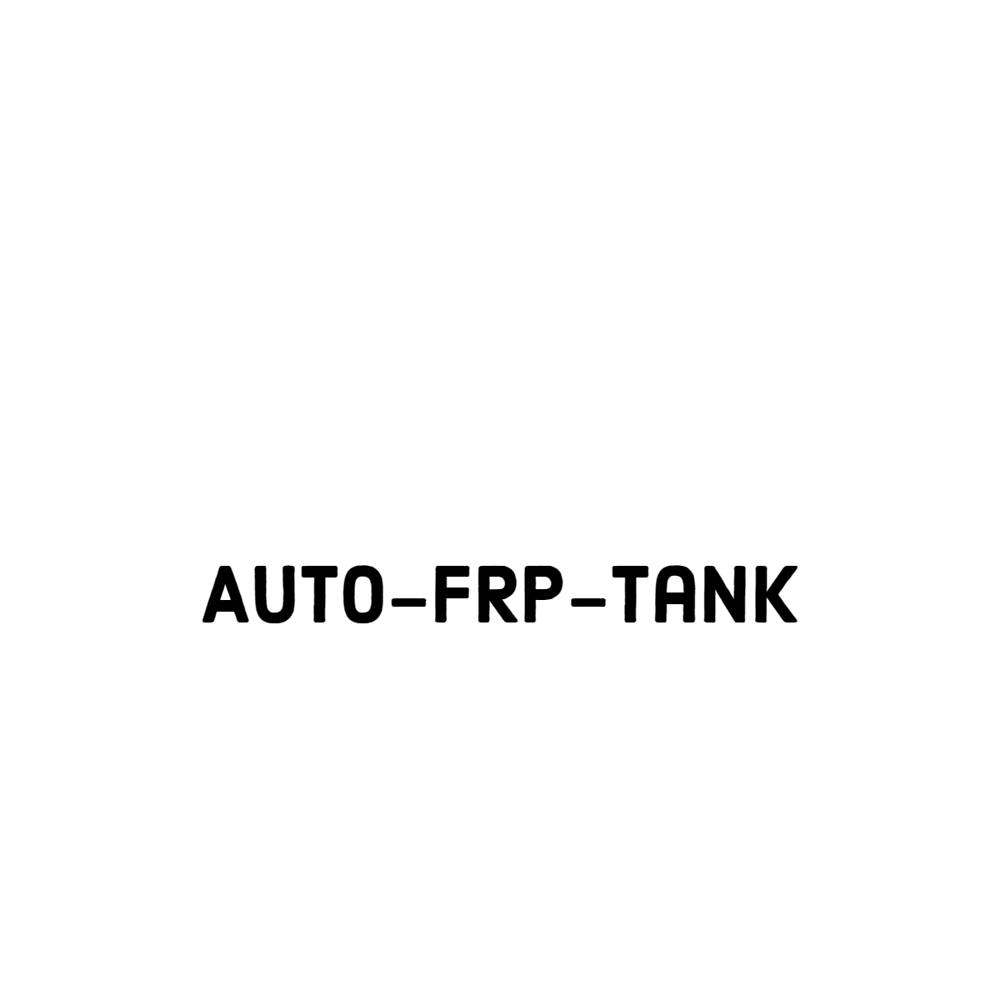

# AutoFRP Tank Designer 

## Installation
Install to `C:\autofrp` by unzipping the release zip file.
1. Create the directory `C:\autofrp`
2. Unzip the release zip file to `C:\autofrp`
3. Run `C:\autofrp\autofrp.exe` to start the program
4. (Optional) Create a shortcut to `C:\autofrp\autofrp.exe` and place it on your desktop

## Usage
1. Run `C:\autofrp\autofrp.exe` to start the program
2. Start solidworks or go to the solidworks menu in the program and click `Start Solidworks`
3. Enter your tank parameters in the program and click `Create Report`. This will create a report of the tank parameters with the name you entered in the program and save it to the `C:\autofrp\<name>.html`. You can open this file in your browser to view the report. You can save it as a pdf from your browser. An example report is shown in `Sample.html`.
4. Click `Create Model` to create a solidworks model of the tank
5. Click `Run Simulation` to run a simulation on the tank
6. You can save your tank parameters by clicking on the file menu and clicking `Save`. You can load your tank parameters by clicking on the file menu and clicking `Load`. This will save your tank parameters to a json file of your choice.

## Development
1. Clone the repository
2. Install python 3.8 or higher
3. Install the requirements with the makefile or `pip install -r requirements.txt`
4. Create the directory `C:\autofrp`
5. Unzip `development/models.zip` to `C:\autofrp\models`
6. Copy `development/123.xlsx` to `C:\autofrp\123.xlsx`
7. run `ui.py` to start the program.
8. Run `make build` to build the program for windows. The executable will be in `dist/autofrptank.exe`
